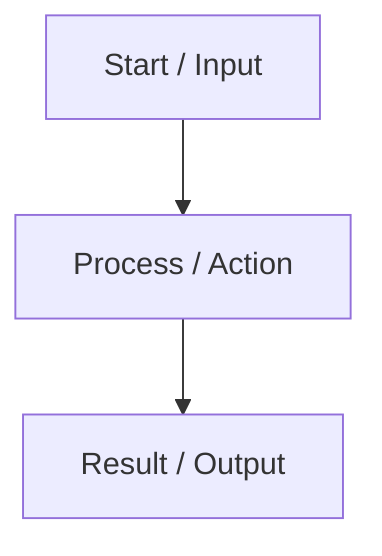

# Teach Me: Software Engineering & Programming Workflow

This skill guides the agent in teaching software engineering and programming concepts clearly and accessibly. It combines up-to-date web research, simple explanations, visual Mermaid diagrams, practical code examples, and structured Obsidian notes.

---

## Workflow Steps

### Step 1: Perform Web Research for Latest Information

Before writing the explanation or creating the note, run a web search using `search_web` to get the latest industry standards, current ecosystem updates, and up-to-date context:

1. Formulate targeted search queries (e.g., `<Topic> best practices 2026`, `<Topic> concept software engineering`, `<Topic> modern implementation`).
2. Extract key updates, modern use cases, and contemporary toolings or patterns associated with the concept.

---

### Step 2: Search Existing Vault Notes for Cross-Linking

Search the vault using `grep_search` to find related topics:

- Search directories such as `core-development/`, `architecture-and-patterns/`, `infrastructure-and-devops/`, and `workspace-and-environment/`.
- Identify related notes to link using Obsidian internal link syntax (`[[Note Name]]`).

---

### Step 3: Determine File Path (If Saving to Vault)

If creating an Obsidian note in the vault, determine the appropriate directory path:

- **General Concepts**: `core-development/concepts/<Topic>.md`
- **Architectures & Patterns**: `architecture-and-patterns/architectures/<Topic>.md` or `architecture-and-patterns/patterns/<Topic>.md`
- **Language-Specific Concepts**: `core-development/programming-languages/<language>/<Topic> in <Language>.md`
- **Algorithms / Data Structures**: `core-development/algorithms/<Topic>.md`
- **DevOps / Infrastructure**: `infrastructure-and-devops/<category>/<Topic>.md`

---

### Step 4: Write Explanation & Note Structure

Use simple sentences, plain language, and clear structure. Avoid dense academic jargon without explanation.

#### Teaching Note Template Structure:

```markdown
---
title: <Topic Title>
category: <category-name>
tags:
  - <tag-1>
  - <tag-2>
created: <YYYY-MM-DD>
updated: <YYYY-MM-DD>
status: active
---

## Overview

A simple, clear summary of what this topic is in plain English. Use short sentences and plain wording so anyone can understand it easily.

## Key Concepts & How It Works

- **Concept 1**: Simple explanation in plain words.
- **Concept 2**: What it does and why we use it.
- **Concept 3**: How it solves a common problem.

## Visual Diagram



## Practical Code Example

Provide a clear, simple, and well-commented code snippet (or real-world scenario example):

```csharp
// Simple, practical code example explaining the concept
```

## Latest Trends & Best Practices

Highlight up-to-date information gathered from recent web research:
- Modern industry adoption and trends.
- Current recommended tools or libraries.
- Modern best practices and common pitfalls to avoid.

## Related Notes

- [[Related Note 1]]
- [[Related Note 2]]
```

---

### Step 5: Update Vault Index Notes

If an Obsidian note was created, link it in the corresponding hub note:

1. For general concepts, update `README.md` under the relevant section.
2. For algorithms, update `core-development/algorithms/Algorithms.md`.
3. For language-specific topics, update the language index note (e.g., `core-development/programming-languages/csharp/CSharp.md`).

---

## Guidelines & Quality Standards

- **Simple Language**: Use simple sentences, direct wording, and clean structure.
- **Up-to-Date**: Always incorporate fresh insights from `search_web`.
- **Visuals First**: Every explanation must feature at least one Mermaid diagram (flowchart, sequenceDiagram, or stateDiagram).
- **Mermaid Validity**: Ensure proper Mermaid syntax. Wrap node labels in quotes if they contain special characters.
- **Obsidian Linking**: Use exact note filenames in internal links (e.g. `[[Clean Architecture]]`).
