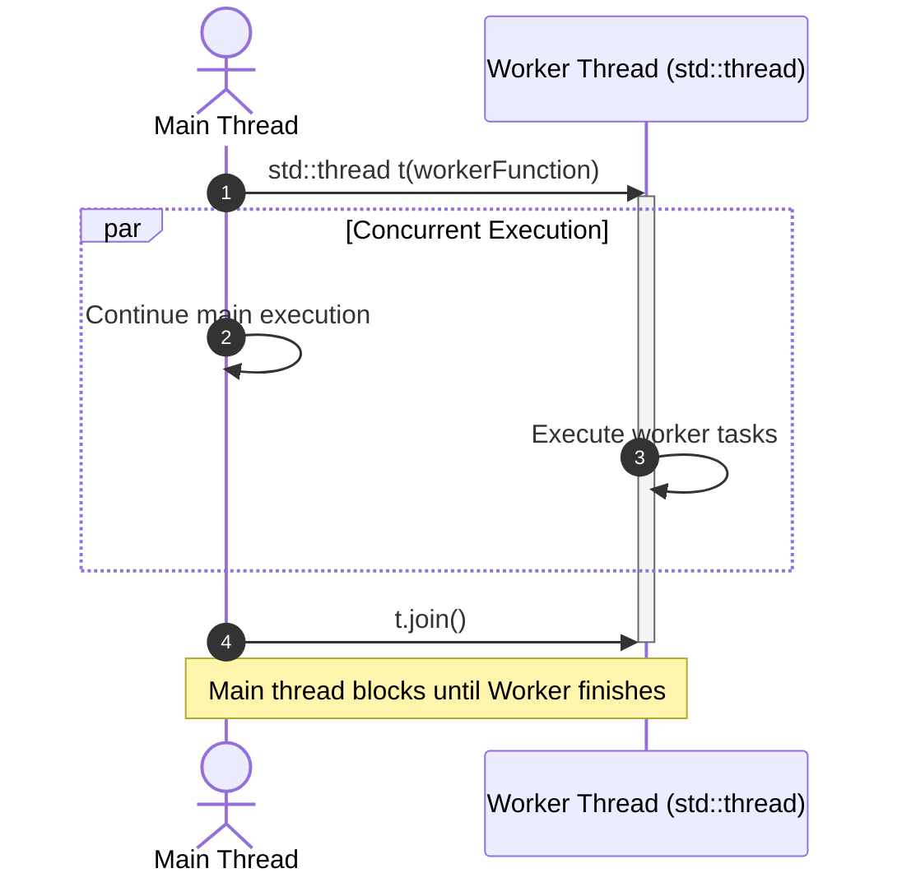

## Overview

In C++, multithreading is supported starting from C++11 via the `<thread>` header and the `std::thread` class. A thread represents an independent execution path within a process. Managing threads properly requires explicit synchronization (e.g. using `std::mutex`) and ensuring threads are either joined (`.join()`) or detached (`.detach()`) before destruction to prevent runtime crashes (`std::terminate`).

---

## Thread Execution Lifecycle



---

## Code Example

```cpp
#include <iostream>
#include <thread>
#include <mutex>
#include <vector>

std::mutex g_mutex;
int g_counter = 0;

void incrementCounter(int id, int iterations) {
    for (int i = 0; i < iterations; ++i) {
        // Lock mutex to ensure thread-safe access to shared resource
        std::lock_guard<std::mutex> lock(g_mutex);
        g_counter++;
    }
    std::cout << "Thread " << id << " completed.\n";
}

int main() {
    const int numThreads = 4;
    const int iterationsPerThread = 1000;
    std::vector<std::thread> threads;

    // Launch worker threads
    for (int i = 0; i < numThreads; ++i) {
        threads.emplace_back(incrementCounter, i + 1, iterationsPerThread);
    }

    // Wait for all threads to finish
    for (auto& t : threads) {
        if (t.joinable()) {
            t.join();
        }
    }

    std::cout << "Final counter value: " << g_counter << "\n";
    return 0;
}
```

---

## Key Considerations & Best Practices

- **Always Join or Detach**: A `std::thread` object destroyed while still joinable calls `std::terminate()`. Use RAII wrappers like `std::jthread` (C++20) for automatic joining upon scope exit.
- **Data Races & Synchronization**: Accessing shared mutable state across threads without protection leads to undefined behavior. Use `std::mutex`, `std::atomic`, or `std::lock_guard`.
- **Pass by Reference**: `std::thread` copies arguments by default. Wrap reference arguments with `std::ref()` when passing references into thread functions.

---

## Related Notes

- [[C++]]
- [[Pass By Reference VS Pass By Value]]
- [[Pointers in C++ or C]]
