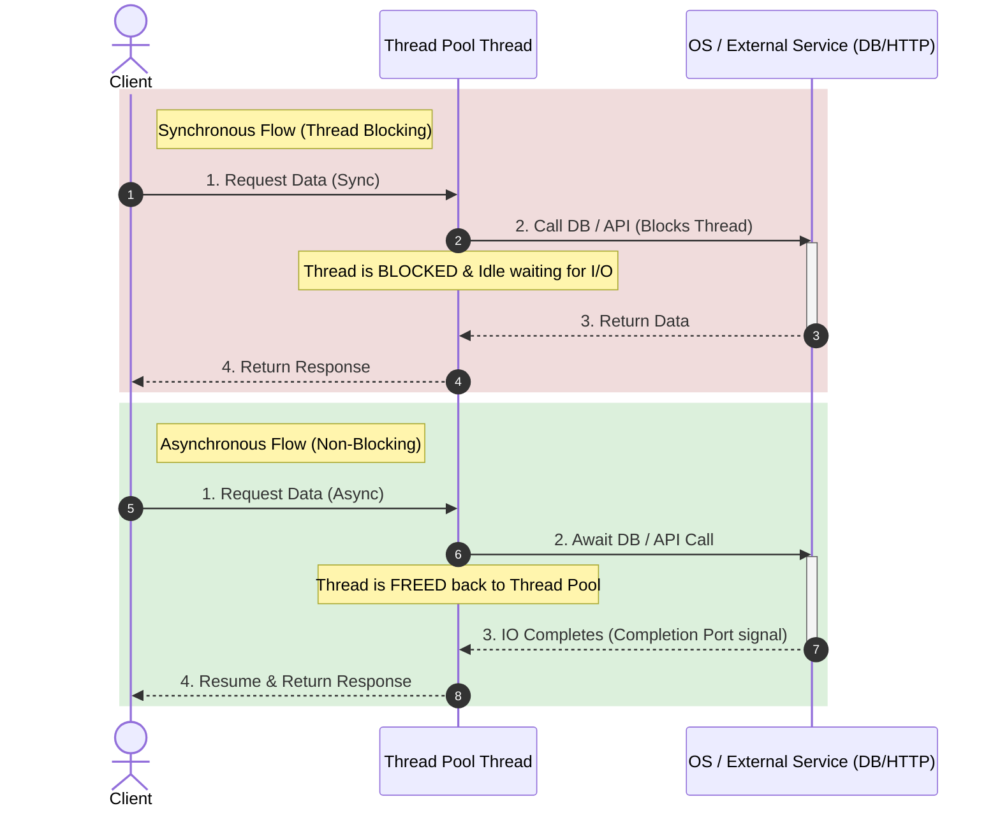

## Overview

In C# and .NET, execution models for handling tasks are divided into **Synchronous (Sync)** and **Asynchronous (Async)** execution:

- **Synchronous Execution**: The calling thread executes code line-by-line and **blocks** while waiting for operations (such as disk I/O, database queries, or HTTP network requests) to complete. The thread remains idle and occupied during the wait period.
- **Asynchronous Execution**: The calling thread initiates an I/O operation and yields control using the `async` and `await` keywords with `Task` or `Task<T>`. Instead of blocking, the thread is released back to the thread pool or UI event loop to handle other requests. Once the asynchronous operation completes, a thread resumes execution from where it paused via a compiler-generated state machine.

### When to Use
- **Use Async**: For **I/O-bound** operations (Web API endpoints, database operations, file reading/writing, network calls) and to maintain UI responsiveness in client applications (WPF, WinUI, MAUI).
- **Use Sync**: For purely **in-memory** operations, short mathematical calculations, or when overhead from task allocation and state machines outweighs the operation runtime.

---

## Architecture / Visual Diagram



---

## Code Example

Below is a practical comparison showing synchronous and asynchronous implementations for fetching external HTTP data in C#:

```csharp
using System;
using System.Net.Http;
using System.Threading;
using System.Threading.Tasks;

public class AsyncVsSyncDemo
{
    private static readonly HttpClient _httpClient = new HttpClient();

    // ==========================================
    // 1. SYNCHRONOUS APPROACH (Blocking)
    // ==========================================
    public static string FetchDataSync(string url)
    {
        // Calling .Result blocks the current thread until the HTTP request completes
        // WARNING: Blocking async code using .Result or .Wait() can cause thread starvation or deadlocks
        HttpResponseMessage response = _httpClient.GetAsync(url).Result;
        return response.Content.ReadAsStringAsync().Result;
    }

    // ==========================================
    // 2. ASYNCHRONOUS APPROACH (Non-blocking)
    // ==========================================
    public static async Task<string> FetchDataAsync(string url, CancellationToken cancellationToken = default)
    {
        // 'await' yields the thread while waiting for network I/O
        HttpResponseMessage response = await _httpClient.GetAsync(url, cancellationToken);
        
        // Ensure successful HTTP status code
        response.EnsureSuccessStatusCode();

        // Read content asynchronously without blocking threads
        string content = await response.Content.ReadAsStringAsync(cancellationToken);
        return content;
    }

    // Example Usage
    public static async Task Main(string[] args)
    {
        string targetUrl = "https://api.github.com";

        Console.WriteLine("Starting Synchronous Call...");
        string syncResult = FetchDataSync(targetUrl);
        Console.WriteLine($"Sync Completed. Received {syncResult.Length} bytes.");

        Console.WriteLine("\nStarting Asynchronous Call...");
        using var cts = new CancellationTokenSource(TimeSpan.FromSeconds(5));
        string asyncResult = await FetchDataAsync(targetUrl, cts.Token);
        Console.WriteLine($"Async Completed. Received {asyncResult.Length} bytes.");
    }
}
```

---

## Key Considerations & Best Practices

- **Async All the Way Down**: Avoid mixing sync and async code (e.g. calling `.Result` or `.Wait()`). Doing so causes context-blocking deadlocks (especially in SynchronizationContext environments like UI apps or legacy ASP.NET) and thread pool starvation.
- **I/O-Bound vs CPU-Bound**:
  - Use `async`/`await` for I/O operations (database, file system, HTTP calls).
  - Use `Task.Run()` to offload **CPU-bound** heavy computations to background threads.
- **Avoid `async void`**: Use `async void` **only** for UI event handlers. Exceptions in `async void` methods cannot be caught by callers and will crash the application process. Always return `Task` or `Task<T>` for async methods.
- **Pass `CancellationToken`**: Accept and pass `CancellationToken` in async APIs to allow callers to cancel pending I/O tasks gracefully.
- **Use `ConfigureAwait(false)` in Libraries**: For class libraries, use `.ConfigureAwait(false)` to prevent capturing the current synchronization context, improving performance and avoiding deadlocks.
- **Consider `ValueTask<T>`**: For high-throughput hot paths where operations frequently complete synchronously, return `ValueTask<T>` instead of `Task<T>` to eliminate heap allocations.

---

## Related Notes

- [[CSharp]]
- [[Dependency Injection in DotNET]]
- [[Ref vs Value in CSharp]]
