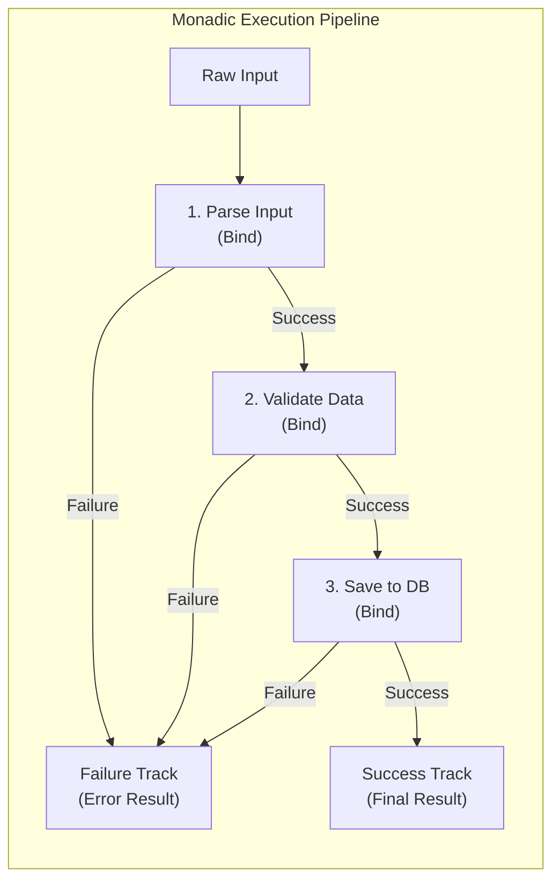

## Overview

A **Monad** is a functional programming design pattern that acts as a container (or wrapper) around a value, allowing you to chain operations together safely while automatically handling boilerplate logic like null checks, asynchronous execution, or error handling.

In simple terms: instead of writing repetitive `if (value != null)` or `try-catch` blocks at every step, a monad encapsulates the value in a box and lets you transform it step-by-step. If any step fails, the monad safely short-circuits the rest of the execution pipeline.

---

## Key Concepts & How It Works

A Monad requires three main parts:

1. **Type Wrapper (`Wrapper<T>`)**: A generic type that holds a underlying value (e.g., `Option<T>`, `Result<T>`, `Task<T>`, `IEnumerable<T>`).
2. **Unit / Return (`Return(value)`)**: A constructor or factory method that takes a plain value and wraps it inside the monadic container.
3. **Bind / FlatMap (`Bind(func)`)**: A method that takes a function `Func<T, Wrapper<U>>`, unrolls the wrapped value, passes it to the function, and flattens the result into `Wrapper<U>`. In C#, `Bind` is implemented as `SelectMany` in LINQ.

### Built-in Monads in C#

You likely use monads every day in modern C# without calling them by name:

- **`IEnumerable<T>` (LINQ)**: A monad representing zero or more values. `Select` acts as `Map`, and `SelectMany` acts as `Bind`.
- **`Task<T>`**: A monad representing a computation that completes in the future. `await` acts as `Bind` by unwrapping the inner value once complete.
- **`Nullable<T>`**: A monad representing a value that might be missing, handled elegantly via `?.` (null-conditional operators).

---

## Visual Diagram

The following diagram illustrates **Railway-Oriented Programming**, a common monadic pattern where operations stay on the **Success Track** until an error occurs, branching permanently onto the **Failure Track**:



---

## Practical Code Example

Below is a complete, lightweight implementation of a `Result<T>` monad in C#, demonstrating method chaining and LINQ support.

```csharp
using System;

namespace FunctionalCSharp;

// 1. Monadic Container representing Success or Failure
public readonly struct Result<T>
{
    public T Value { get; }
    public string Error { get; }
    public bool IsSuccess { get; }
    public bool IsFailure => !IsSuccess;

    private Result(T value)
    {
        Value = value;
        Error = string.Empty;
        IsSuccess = true;
    }

    private Result(string error)
    {
        Value = default!;
        Error = error;
        IsSuccess = false;
    }

    // Factory methods (Unit / Return)
    public static Result<T> Success(T value) => new(value);
    public static Result<T> Failure(string error) => new(error);

    // Bind operation: chains another monadic function
    public Result<U> Bind<U>(Func<T, Result<U>> func)
    {
        if (IsFailure) return Result<U>.Failure(Error);
        return func(Value);
    }

    // Map operation: transforms inner value
    public Result<U> Map<U>(Func<T, U> func)
    {
        if (IsFailure) return Result<U>.Failure(Error);
        return Result<U>.Success(func(Value));
    }

    // Match operation: extracts final output at the boundary
    public TR Match<TR>(Func<T, TR> onSuccess, Func<string, TR> onFailure)
    {
        return IsSuccess ? onSuccess(Value) : onFailure(Error);
    }
}

// 2. LINQ Extension method enabling 'SelectMany' syntax in C#
public static class ResultExtensions
{
    public static Result<U> SelectMany<T, U>(this Result<T> result, Func<T, Result<U>> func)
        => result.Bind(func);
}

// 3. Usage Example
public class Program
{
    public static void Main()
    {
        string rawEmail = "  user@example.com ";

        // Fluent Monadic Chaining (Railway-Oriented)
        Result<string> finalResult = ValidateNotEmpty(rawEmail)
            .Bind(SanitizeEmail)
            .Bind(CheckDatabaseAvailability);

        string responseMessage = finalResult.Match(
            onSuccess: email => $"User registered successfully with {email}",
            onFailure: error => $"Registration failed: {error}"
        );

        Console.WriteLine(responseMessage);
    }

    private static Result<string> ValidateNotEmpty(string input) =>
        string.IsNullOrWhiteSpace(input) 
            ? Result<string>.Failure("Email cannot be empty.") 
            : Result<string>.Success(input);

    private static Result<string> SanitizeEmail(string input) =>
        Result<string>.Success(input.Trim().ToLower());

    private static Result<string> CheckDatabaseAvailability(string email) =>
        email.Contains("admin") 
            ? Result<string>.Failure("Admin emails are restricted.") 
            : Result<string>.Success(email);
}
```

---

## Latest Trends & Best Practices

- **Railway Oriented Programming**: Use `Result<T, TError>` or `Either<L, R>` types to replace control-flow exceptions with explicit return types for domain errors.
- **Pure Functions**: Keep functions passed to `Bind` pure (free of unhandled side-effects) to maintain predictability and simplify unit testing.
- **Pattern Matching at Boundaries**: Always resolve monadic types using `.Match()` or C# `switch` pattern matching at application boundaries (e.g., ASP.NET Core Controllers or MediatR Handlers).
- **Leverage Ecosystem Libraries**: For production-grade .NET codebases, consider using mature libraries like **LanguageExt** (`LanguageExt.Core`) or **CSharpFunctionalExtensions** rather than rolling custom monads.
- **Combine with Records**: Combine monads with C# `record` types and `readonly struct` for memory-efficient and immutable functional data modeling.

---

## Related Notes

- [[CSharp]]
- [[Async vs Sync in CSharp]]
- [[SOLID Principle]]
- [[Clean Architecture]]
