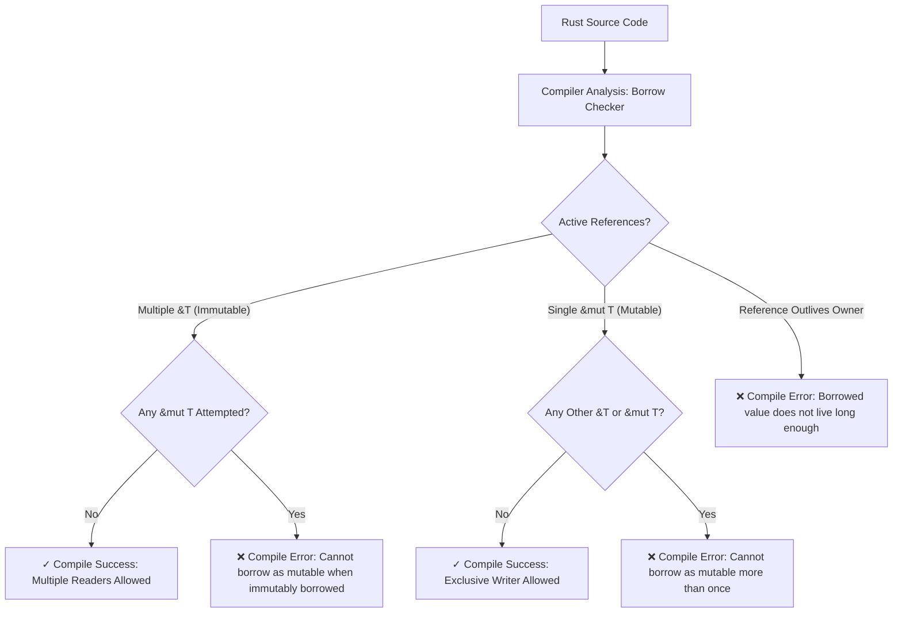

## Overview

The **Borrow Checker** is a core component of the Rust compiler (`rustc`) that enforces memory safety and thread safety at compile-time without relying on a garbage collector (GC) or manual memory management (like C/C++ `malloc`/`free`).

It tracks the ownership, references, and lifetimes of all variables to prevent critical memory bugs at compile time, including:
- **Dangling pointers** (referencing memory after it has been deallocated).
- **Double free** errors (attempting to free the same memory twice).
- **Use-after-free** bugs.
- **Data races** in concurrent/multithreaded execution.

### The Three Fundamental Rules of Ownership & Borrowing
1. **Ownership**: Each value in Rust has a single variable as its owner. When the owner goes out of scope, the memory allocated for the value is automatically dropped (`Drop` trait).
2. **Aliasing XOR Mutability**: At any given point in a program's execution, a resource can have:
   - **Any number of immutable references (`&T`)**, OR
   - **Exactly one mutable reference (`&mut T`)**.
3. **Valid Lifetimes**: References must always be valid and cannot outlive the owner of the underlying data.

---

## Architecture / Visual Diagram



---

## Code Example

The code snippet below illustrates how the Rust compiler enforces borrowing rules, highlighting what is valid vs invalid, along with fixes:

```rust
struct User {
    username: String,
    active: bool,
}

fn main() {
    let mut user = User {
        username: String::from("alice"),
        active: true,
    };

    // ========================================================
    // 1. VALID: Multiple Immutable References (&T)
    // ========================================================
    let ref1 = &user.username;
    let ref2 = &user.username;
    println!("Readers: {} and {}", ref1, ref2); // Valid: multiple readers allowed

    // ========================================================
    // 2. INVALID: Simultaneous Mutable and Immutable References
    // ========================================================
    /*
    let r_immut = &user.username;
    let r_mut = &mut user.username; // COMPILE ERROR: cannot borrow `user.username` as mutable 
                                    // because it is also borrowed as immutable
    println!("{}", r_immut);
    */

    // ========================================================
    // 3. VALID: Exclusive Mutable Reference (&mut T)
    // ========================================================
    // Note: Due to Non-Lexical Lifetimes (NLL), ref1 and ref2 are no longer used below this line,
    // so their borrows end here, allowing a mutable borrow!
    let mut_ref = &mut user.username;
    mut_ref.push_str("_admin");
    println!("Updated username: {}", mut_ref);

    // ========================================================
    // 4. PREVENTING DANGLING REFERENCES
    // ========================================================
    // The function call below shows how lifetime checking prevents returning dangling pointers
    // let dangling = create_dangling_reference(); // Will not compile!
}

/*
// Compiler Rejection Example:
fn create_dangling_reference() -> &String {
    let s = String::from("hello");
    &s // ERROR: `s` is dropped at end of scope! Returning reference to dropped memory is illegal.
}
*/

// Correct pattern: Return owned data instead of reference
fn create_owned_string() -> String {
    let s = String::from("hello");
    s // Ownership moved to caller
}
```

---

## Key Considerations & Best Practices

- **Aliasing XOR Mutability**: Remember the formula: **Data Races = Aliasing + Mutability**. By forbidding `&mut T` when `&T` exists, Rust prevents data races at compile time without performance overhead.
- **Non-Lexical Lifetimes (NLL)**: Modern Rust compilers end reference scopes at their last point of usage rather than at the end of the enclosing block (`}`), making borrowing far more intuitive.
- **Move vs Copy**: Types implementing `Copy` (like `i32`, `bool`) duplicate data automatically on assignment. Heap-allocated types (like `String`, `Vec<T>`) move ownership unless explicitly cloned (`.clone()`).
- **Interior Mutability**: For situations requiring multiple references to mutate data (e.g. graph structures), use Rust's interior mutability patterns:
  - `Cell<T>` / `RefCell<T>` (Single-threaded runtime borrow checking).
  - `Mutex<T>` / `RwLock<T>` (Thread-safe concurrency synchronization).
- **Explicit Lifetime Annotations (`'a`)**: When a function takes multiple reference parameters and returns a reference, annotate lifetimes (e.g., `fn longest<'a>(x: &'a str, y: &'a str) -> &'a str`) to inform the borrow checker how return lifetimes depend on inputs.

---

## Related Notes

- [[Rust]]
