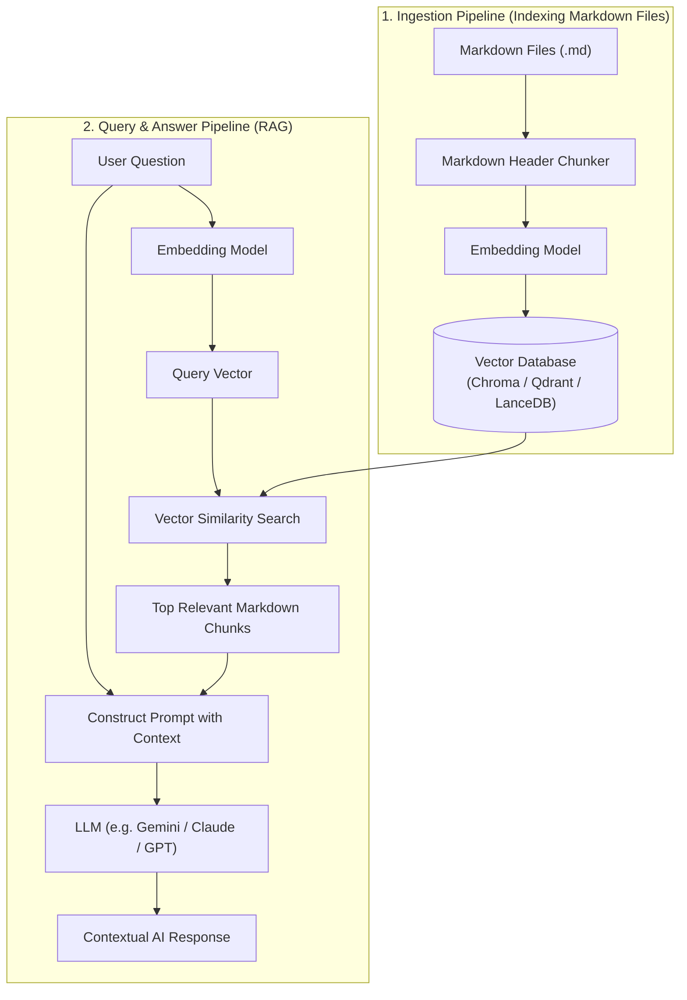

## Overview

A **Vector Database** is a specialized database designed to store, index, and query high-dimensional numerical vectors (called **embeddings**). Unlike traditional databases that search by exact keywords or SQL queries, a vector database searches by **semantic meaning**.

When working with Large Language Models (LLMs), a vector database acts as an external long-term memory. It allows an AI to instantly search through thousands of local Markdown files, locate the most relevant sections, and answer questions based on the exact context of your personal vault or codebase.

---

## Key Concepts & How It Works

1. **Text Embeddings**: An embedding model transforms text (words, sentences, or Markdown sections) into a vector of numbers (e.g., `[0.015, -0.412, 0.891, ...]`). Texts with similar meanings end up close together in mathematical space.
2. **Markdown-Aware Chunking**: Splitting Markdown files into smaller logical pieces based on headers (`#`, `##`, `###`) so that paragraphs and code snippets retain their context.
3. **Vector Similarity Search**: Measuring how close a user query's vector is to stored document vectors using metrics like **Cosine Similarity** or **Euclidean Distance**.
4. **Retrieval-Augmented Generation (RAG)**: The overall process where:
   - User asks a question.
   - The question is converted into a vector.
   - The Vector DB retrieves the top matching Markdown chunks.
   - The retrieved chunks are passed as context to the LLM to generate an accurate answer.

---

## Visual Diagram



---

## Practical Code Example

Below is a complete Python script using **LangChain** and **ChromaDB** to index a folder of `.md` files and query them using RAG:

```python
import os
from langchain_community.document_loaders import DirectoryLoader, TextLoader
from langchain_text_splitters import MarkdownHeaderTextSplitter, RecursiveCharacterTextSplitter
from langchain_community.vectorstores import Chroma
from langchain_community.embeddings import FastEmbedEmbeddings # Local lightweight embedding model

# Step 1: Define Markdown Vault Directory & Setup
VAULT_PATH = "./my_markdown_vault"
DB_DIR = "./chroma_db"

# Step 2: Load Markdown Files
print("Loading Markdown files...")
loader = DirectoryLoader(
    VAULT_PATH, 
    glob="**/*.md", 
    loader_cls=TextLoader,
    loader_kwargs={"encoding": "utf-8"}
)
documents = loader.load()

# Step 3: Markdown Header-Aware Chunking
# Split by headers to preserve semantic context of notes
headers_to_split_on = [
    ("#", "Header 1"),
    ("##", "Header 2"),
    ("###", "Header 3"),
]
markdown_splitter = MarkdownHeaderTextSplitter(headers_to_split_on=headers_to_split_on)

chunks = []
for doc in documents:
    # Split text by Markdown headings
    header_splits = markdown_splitter.split_text(doc.page_content)
    for split in header_splits:
        # Preserve original source filename in metadata
        split.metadata["source"] = doc.metadata["source"]
        chunks.append(split)

print(f"Created {len(chunks)} contextual chunks from {len(documents)} markdown files.")

# Step 4: Generate Embeddings and Store in Vector DB
embedding_function = FastEmbedEmbeddings(model_name="BAAI/bge-small-en-v1.5")

vector_db = Chroma.from_documents(
    documents=chunks,
    embedding=embedding_function,
    persist_directory=DB_DIR
)
print("Vector database created successfully!")

# Step 5: Query the Vector DB (Semantic Context Retrieval)
query = "How do I implement Clean Architecture in C#?"
print(f"\nQuerying: '{query}'")

matching_docs = vector_db.similarity_search(query, k=3)

print("\n--- Top Relevant Context Found ---")
for i, doc in enumerate(matching_docs, 1):
    source_file = doc.metadata.get("source", "Unknown")
    print(f"\nResult #{i} (Source: {source_file}):")
    print(doc.page_content[:300] + "...")
```

---

## Latest Trends & Best Practices

- **Popular Vector Databases**:
  - **Chroma**: Python-native, zero-config local vector database; perfect for personal vaults and quick prototypes.
  - **LanceDB**: Serverless, file-based columnar vector database; extremely fast for disk-bound local storage.
  - **Qdrant**: High-performance Rust-based database; best for production scaling and hybrid filtering.
  - **pgvector**: PostgreSQL extension that adds vector search directly inside relational databases.
- **Structure-Aware Chunking**: Never use naive character-count chunking for Markdown. Always split along Markdown headers (`#`, `##`) or code blocks to keep technical concepts intact.
- **Hybrid Search**: Combine vector dense search (semantic meaning) with BM25 sparse keyword search (exact code symbols/names) for higher accuracy.
- **Local Embeddings**: Use lightweight ONNX-based local embedding models (`bge-small-en`, `nomic-embed-text`) to index files offline without sending data to third-party APIs.

---

## Related Notes

- [[PostgreSQL]]
- [[Antigravity CLI]]
- [[Outbox Pattern]]
